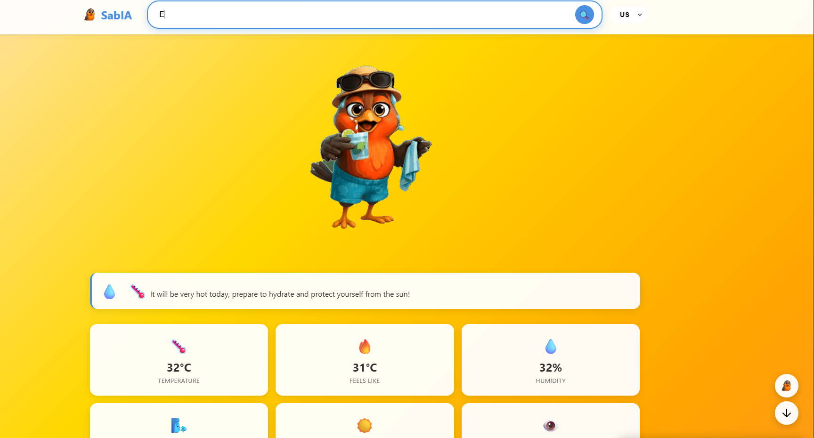

# NASA_SabIA

# 🐦 SabIA – Will it rain on my parade
## 🌤️ About the project
SabIA is a web and mobile application that transforms meteorological information into a visual, educational, and entertaining experience.

The idea is simple: an intelligent thrush bird reacts to real-time weather conditions, changing its appearance and behavior according to the detected climate.

More than just displaying numerical data, SabIA helps the user understand what the weather really means — whether the day is too hot, too cold, too humid, or simply uncomfortable.

💬 “It’s very hot today! Drink plenty of water and wear sunscreen!”

SabIA aims to bring convenience to the hectic urban life as well as to the cyclical life in the countryside. In large cities, even a small change in the weather can delay traffic, cause flooding, and disrupt outdoor events. In rural areas, however, the weather governs the entire production cycle it is crucial to know in advance when the rainy season will begin in order to plan the best time to plant and harvest, as well as to organize the logistics of purchasing seeds and transporting the crops.

To achieve this goal, the heart of SabIA is powered by an AI agent trained on historical climate data collected by NASA’s high-tech equipment. This intelligent agent is capable of predicting future weather conditions all that’s needed is to provide the date you want to forecast.

### Our Mascot – The SabIA 🐦

||A wise and curious little bird, native to Parque do Sabiá, who has always observed nature and the weather around him. One day, he decided to learn about Machine Learning to forecast the weather and help the residents of Uberlândia — and now, people all over the world. It represents the harmony between nature and artificial intelligence, combining reliable data from NASA satellites with an intuitive and secure interface designed to take care of you.|
|---------------------------------|----------------------------------------------------------------------------|

---

## 📱 Platforms

### 🌐 Web App – accessible via browser on any device.

### 📲 Mobile App – ersion adapted for Android and iOS (PWA or native app).
---

## 🎯 Objetivo

→ Make weather monitoring more human and intuitive by combining

→ Data science and AI (for classifying weather types and forecasting temperatures up to 6 months ahead).

→ Empathetic design (animated character).

→ Accessibility and natural language.

---

## 🌎 Main Features

| Função                          | Descrição                                                                 |
|---------------------------------|----------------------------------------------------------------------------|
| 🔍 **Location search**       | Allows searching for cities, neighborhoods, or tourist attractions.                  |
| 🌡️ **Current weather display**   | Displays temperature, thermal sensation, humidity, and wind.                    |
| 🌡️ **Future weather display**   | Uses an AI-powered model to predict future weather data. |
| 🐦 **Interactive character (SabIA)** | Changes appearance according to the detected weather type.                    |
| 💬 **Contextual message**       | Dynamic message according to the weather type.            |
| 🎨 **Dynamic theme**             | Colors and icons adapt to the weather type.                          |
| 📱 **Responsive layout**         | Seamless experience on desktop and mobile devices.                       |

## 🐦 Weather types and SabIA’s behavior

| Weather Type       | SabIA’s Appearance                         | Example Message                                    |
|----------------------|---------------------------------------------|--------------------------------------------------------|
| ☀️ **Very Hot**       | Wearing sunglasses and sweating | “It’s very hot stay hydrated!”            |
| ❄️ **old**      |Wearing a scarf and beanie                       |“It’s cold! Dress warmly and avoid staying out in the open.”    |
| 💨 **Windy**     | Disheveled, holding a hat           | “Windy day  be careful with light objects!”               |
| 🌧️ **Humid**       | Casual clothes with a towel                  | “It’s going to rain don’t forget your umbrella!”              |
| 😓 **Uncomfortable** | Sweating and exhausted                       | “The weather is tough today take some rest and cool down.”    |
| 😎 **Summer Hot** | Beachwear and holding a cup                      | “It’s going to be very hot today make sure to stay hydrated and protect yourself from the sun!”   |
| 🌧️ **Rain** | Holding an umbrella                        | “It’s cloudy and it might rain! Take an umbrella and don’t forget to close your windows before leaving.”   |

 |  |  |  |  |
|----------------------------------------|----------------------------------------|----------------------------------------|----------------------------------------|
|  |  |  |                                        |

## 🧠 Classificação de Clima (exemplo de lógica)

| Weather Type        | Simplified Criterion                                       |
|--------------------------|--------------------------------------------------------------|
| ☀️ **Very Hot**          | Temperature > 35 °C and humidity < 60 %                       |
| ❄️ **Cold**         | Temperature < 10 °C                                      |
| 🌧️ **Humid**          | Humidity > 80 %                |
| 💨 **Windy**        | Wind speed > 60 km/h                                |
| 😓 **Uncomfortable**| High heat index (high temperature + high humidity)    |
| 😎 **Summer Hot**| Moderate temperature and no precipitation    
| 🌧️ **Rain**| High rainfall precipitation   

These criteria are defined based on a global consensus.
---

## 🧩 Front-End
abIA’s front end is entirely built using HTML, CSS, and JavaScript, enabling a responsive, user-friendly, and easily accessible experience.

The front end is responsive; our mascot adapts to the current weather by dressing appropriately and giving tips to the user.

The platform is available in three languages  **Portuguese**, **English**, and **Spanish** and allows users to check the weather for any location on the planet. Our front end provides all the basic weather forecast data such as maximum and minimum temperature, relative humidity, wind speed, and probability of precipitation.

O front é integrado a uma API alimentado por IA capaz de fazer predições de dados climáticos futuros. Além disso a API também fornece os dados climáticos atuais que são apresentados por padrão no painel da interface.

## 🛠️ Front-End Technologies

→ Html

→ CSS

→Javascript

→ PWA (Progressive Web App) for offline use and mobile installation

---

## 🧩 Back-End

O BackEnd do SabIA é composto de dois grandes blocos, o primeiro é o modelo de predição alimentado com os dados [da nasa] contendo dados climaticos historicos, tais como precipitações, eventos como _el niño_ e _la niña_ e ciclones tropicias. A construção do modelo está descrita na proxima seção.

O outro bloco é um sitema de API capaz de pegar os dados climaticos em tempo real, bem como solicitar a predição do clima para dias futuros para o modelo de aprendizado de maquina no coração do SabIA.

A API é toda construida em python utilizando a estrutura do pacote FastAPI, expondo para o front os seguintes end-points que são utilizados para construir o painel da ferramenta.

[lista de endpoints]

## 🛠️ Tecnologias do Back-End

→ Python.

→ FastAPI.

→ [ferramentas de IA].

---

## 📸 Visual Example

City: São Paulo - Brasil

